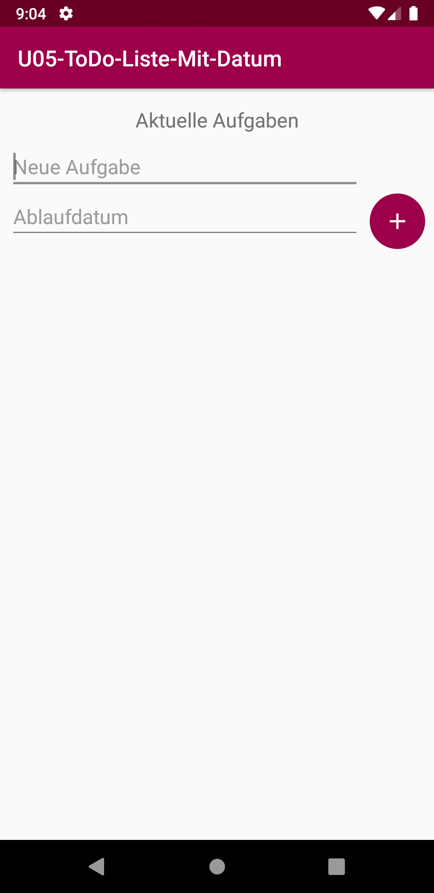
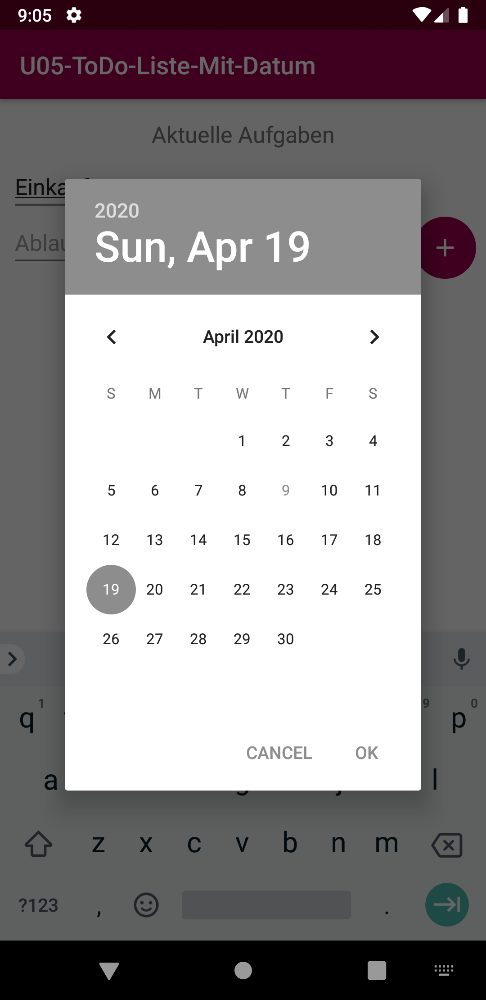
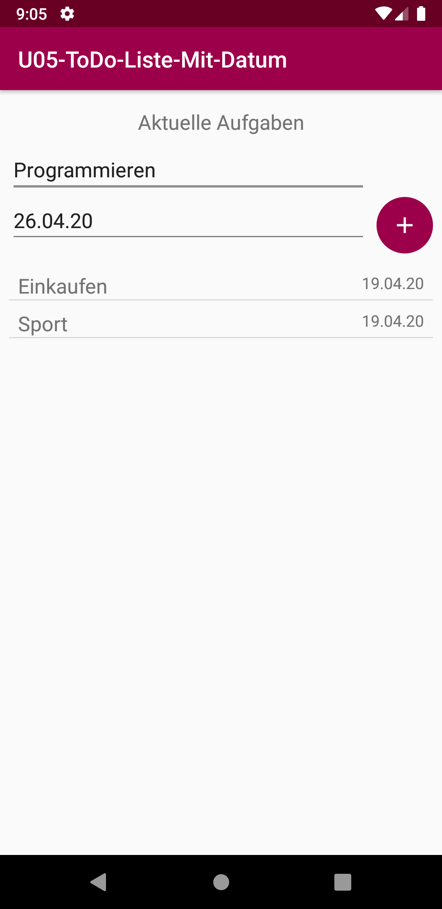

# U05 | CustomAdapter

## Downloads

- [Download des Starterpakets](https://github.com/Android-Regensburg/U05-ToDo-Liste-Mit-Datum/archive/master.zip)
- [Download des Lösungsvorschlag](https://github.com/Android-Regensburg/U05-ToDo-Liste-Mit-Datum/archive/solution.zip)

## Aufgabe

Erweitern Sie das bereitgestellte Starter-Projekt zu dieser Übung. Der Nutzer muss nun, zusätzlich zum Task-Titel, auch ein Fälligkeitsdatum für jeden Task angeben. Dies geschieht über ein zusätzliches Eingabefeld (*siehe Screenshots*). Modellieren Sie den komplexen Datentyp `TaskItem` der den Titel und das Fälligkeitsdatum enthält. Anschließend müssen Sie ein Layout für die Listeneinträge anlegen. Um den View mit den Daten der `TaskItems` zu befüllen, schreiben Sie noch einen `TaskListAdapter`, welcher von `ArrayAdapter` erbt und diesen erweitert.

## Hinweise

1. Der `ArrayAdapter` wird benötigt, um Daten mit einer `View` zu verbinden. Für komplexere `Views`, wie in dieser Übungsaufgabe, muss von `ArrayAdapter` geerbt und die Methode `getView()` überschrieben werden.

2. Der `DatePickerDialog` fordert den Benutzer auf, ein Datum mit Hilfe von drei Spinnern auszuwählen. Der `DatePickerDialog` ist bereits im Starter-Projekt integriert.

3. Ein Datum wird in Java gewöhnlich als Objekt der Klasse `Date` gespeichert. Um dieses in einen formatierten `String` umzuwandeln (und umgekehrt) benutzt man die Klasse `DateFormat`. Für Umwandlungen zu einzelnen `Integern`, etwa für Tag, Monat und Jahr, benutzt man die Klasse `GregorianCalendar`.

## Vorgehen

### Layout

1. Laden Sie das Starter-Packet zur Übung herunter. Dabei handelt es sich um die Lösung zur Aufgabe von letzter Woche, die um einige Methoden und die Klasse `TaskItem` ergänzt wurde. Des Weiteren wurde die `ToDoActivity` um Methoden zur Abfrage des Datums ergänzt.

2. Passen Sie zunächst die `activity_main.xml` Layout-Datei an, wie in den Screenshots im Anhang zu sehen. Mit Hilfe des Attributs `android:focusable` können Sie verhindern, dass der Text im Datums-Textfeld manuell geändert werden kann (die Eingabe soll über den `DatePickerDialog` geschehen).

3. Tragen Sie die zusätzlich benötigten Strings in die `strings.xml` ein.

4. Erstellen Sie nun eine neue `Layout.xml` im `layout`-Ordner, welche das Aussehen eines einzelnen `ListItems` definiert. Es soll jeweils der Titel und das Fälligkeitsdatum nebeneinander gezeigt werden. Damit die Höhe der `ListItems` den Android Design Guidelines entspricht, kann man sie folgendermaßen definieren: `android:layout_height="?android:attr/listPreferredItemHeight"` Sie können bequem eine neue `Layout.xml`-Datei anlegen, indem Sie mit der rechten Maustaste auf den `layout`-Ordner (unter res zu finden) klicken und im Kontextmenü „New“, „XML“ und dann „Layout XML file“ auswählen.

### ToDoItem-Klasse

Ergänzen Sie nun die Klasse `TaskItem`, welche den Titel eines Tasks und sein Fälligkeitsdatum speichert.

1. Der Konstruktor erwartet einen String für den Titel und einen String für das Datum.

2. Erstellen Sie die benötigten Instanzvariablen und weisen sie deren Werte im Konstruktor zu.

3. Die Methode `getTask()` soll den Titel des Tasks zurückgeben.

4. Mit der Methode `getDateFromString()` können sie das übergebene Datum in ein `GregorianCalender` Objekt umwandeln welches sich zum speichern von Daten eignet.

### ToDoListAdapter implementieren

Es fehlt nun noch ein Adapter, welcher den komplexen Datentyp `TaskItem` mit dem Layout verknüpft. Ergänzen Sie hierfür die Klasse `ToDoListAdapter`. Diese soll von `ArrayAdapter<TaskItem>` erben.

1. Überschreiben Sie die Methode `getView(int position, View convertView, ViewGroup parent)`. Sie soll mit Hilfe des `LayoutInflaters` einen `View` mit dem Layout des `ToDoItems` erstellen und die `TextViews` des Layouts mit den Daten des entsprechenden `TaskItems` befüllen.

2. Passen Sie im Konstruktor die Referenz auf das Layout der `ListItems` an.

3. Jetzt kann der `ToDoListAdapter` wie bisher der `ArrayAdapter` in der `ToDoActivity` verwendet werden.

4. Nutzen sie die `getFormattedDate()`-Methode um das Datum als String aus einem `TaskItem` Objekt zu holen.

### ToDoActivity implementieren

1. Tauschen Sie nun den bisher verwendeten `ArrayAdapter` durch den von Ihnen vervollständigten `ToDoListAdapter` aus.

2. Um ein neues `TaskItem` zu erstellen und der Liste hinzuzufügen, brauchen sie zuerst den Titel und das Datum, welche sie aus den entsprechenden Views auslesen können.

3. Passen Sie ggf. die vorhandenen Methoden an, oder erstellen Sie neue.

4. Um den Dialog zur Erfassung des Datums aufzurufen, verwenden sie die bereits angelegte Methode `createDatePickerDialog()`. Rufen sie auf dem zurückgegeben Objekt die Methode `show()` auf um den Dialog anzuzeigen.

5. Passen sie die `onDateSet()`-Methode so an, dass beim Aufruf dieser der Inhalt des Textfeldes ihres Date-EditText auf das gewählte Datum geändert wird.

6. Nun können Sie ein Objekt der Klasse `TaskItem` erstellen und der `ArrayList<TaskItem>` hinzufügen.

## Quellen

Große Teile dieser Anleitung wurden aus der Übungsaufgabe 5 des Sommersemesters 2013 von Thomas Wagner übernommen, welche von Thomas Wilhelm und Jonas Roberts überarbeitet wurden.

## Screenshots

